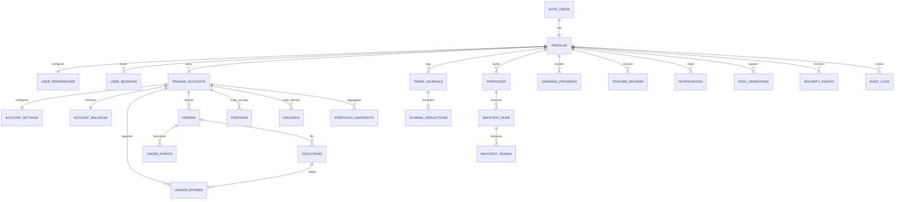

# TradeGuru AI — Multi-Tenant Domain Entity-Relationship Diagram

```mermaid
erDiagram
    AUTH_USERS ||--|| PROFILES : has
    PROFILES ||--|| USER_PREFERENCES : configures
    PROFILES ||--o{ USER_SESSIONS : tracks
    PROFILES ||--o{ TRADING_ACCOUNTS : owns
    TRADING_ACCOUNTS ||--|| ACCOUNT_SETTINGS : configures
    TRADING_ACCOUNTS ||--|| ACCOUNT_BALANCES : maintains
    TRADING_ACCOUNTS ||--o{ LEDGER_ENTRIES : appends
    TRADING_ACCOUNTS ||--o{ ORDERS : submits
    ORDERS ||--o{ ORDER_EVENTS : transitions
    ORDERS ||--o{ EXECUTIONS : fills
    EXECUTIONS ||--o{ LEDGER_ENTRIES : settles
    TRADING_ACCOUNTS ||--o{ POSITIONS : holds_intraday
    TRADING_ACCOUNTS ||--o{ HOLDINGS : holds_delivery
    TRADING_ACCOUNTS ||--o{ PORTFOLIO_SNAPSHOTS : aggregates
    PROFILES ||--o{ TRADE_JOURNALS : logs
    TRADE_JOURNALS ||--o| JOURNAL_REFLECTIONS : annotates
    PROFILES ||--o{ STRATEGIES : builds
    STRATEGIES ||--o{ BACKTEST_RUNS : executes
    BACKTEST_RUNS ||--o{ BACKTEST_TRADES : produces
    PROFILES ||--o{ LEARNING_PROGRESS : masters
    PROFILES ||--o{ TEACHER_REVIEWS : receives
    PROFILES ||--o{ NOTIFICATIONS : reads
    PROFILES ||--o{ SYNC_OPERATIONS : queues
    PROFILES ||--o{ SECURITY_EVENTS : monitors
    PROFILES ||--o{ AUDIT_LOGS : chains
```
